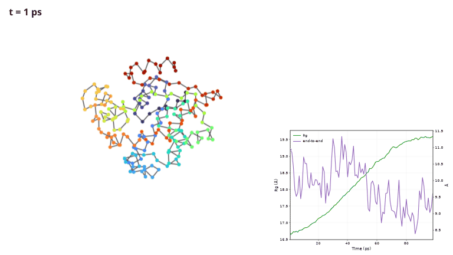
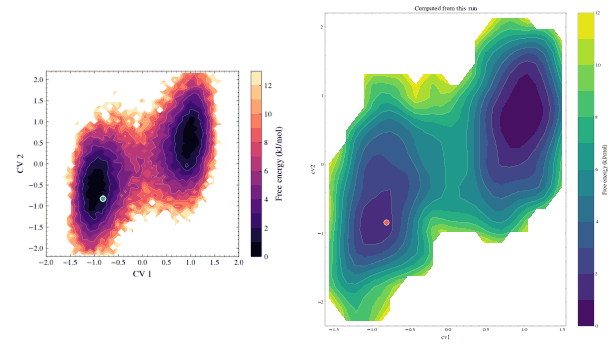
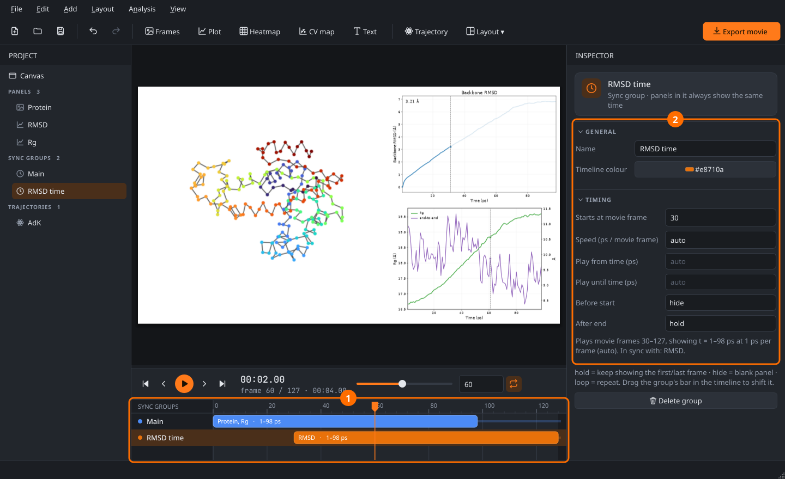

# MD Movie Maker

Turn a molecular dynamics simulation into a multi-panel movie: your rendered protein next to live plots of RMSD, radius of gyration, secondary structure or any property you can compute with MDAnalysis. The panels can play in sync or each on its own clock.





**→ New here? Follow the [illustrated tutorial](docs/TUTORIAL.md)**: about 15 minutes, using example data that ships with MDAnalysisTests.



## Features

- **Any layout.** Split, resize and swap cells, or start from a template. Text labels, logos or inset plots can float on top as overlays. The layout is resolution-independent (1080p, 4K, square, portrait, …).
- **Protein frames from any viewer.** Point the app at a folder of images from VMD, PyMOL or ChimeraX. It times them by file number or by position in the folder and reports missing frames.
- **Cropping with a fixed aspect ratio.** Lock the box to 16:9, 4:3, 1:1, a custom ratio or the shape of the cell. *Auto-trim* fits the crop around the molecule across the whole trajectory.
- **Analysis presets on an MDAnalysis Universe.**
  - Built in: RMSD, Rg, RMSF, distances, dihedrals, H-bonds, native contacts, DSSP, atoms within a cutoff, and custom Python expressions.
  - Several presets and trajectories can share one plot, with twin y-axes.
  - Analyses run in the background and results are cached.
  - [Add your own presets](docs/TUTORIAL.md#12-write-your-own-analysis-preset) in a few lines.
- **Synced or independent panels.** Sync groups map movie frames to simulation time. Shift, speed up, trim, hold, hide or loop each group, and drag it on the timeline.
- **Plot animations.** Four styles: the line grows, a marker moves, the axis scrolls, or the plot stays static. A live value readout is optional.
- **Publication styles.** [SciencePlots](https://github.com/garrettj403/SciencePlots) styles (science, nature, ieee, notebook) and colour palettes, optional LaTeX, and fine control over ticks, frame, grid, limits, log scale, reference lines and legends. Each series gets its own line style, markers, width, opacity and fill.
- **Trajectories on free-energy surfaces.** Draw the current CV values as a moving point with a fading trail on top of a **pre-rendered FES picture** (calibrated in one dialog), or use the **CV map** panel to compute −kT ln P from the data. PLUMED COLVAR, GROMACS .xvg and CSV files load directly, no trajectory needed.
- **Export** to MP4 (H.264), GIF or a PNG sequence from the GUI, or headless with `mdmovie render`. The preview shows exactly what gets exported.
- Undo/redo for every edit, and projects saved as small JSON files with relative paths.

## Quick start

```bash
uv venv -p 3.14 .venv && uv pip install -p .venv/bin/python -e ".[test]"
.venv/bin/mdmovie                                   # GUI (try File › Open demo project)
.venv/bin/mdmovie render my.mdmovie.json out.mp4    # render without the GUI
```

## Code map

```
mdmovie/core/       sync model (timemap), layout tree, crop math, project file
mdmovie/sources/    image sequences + LRU cache, trajectory metadata
mdmovie/analysis/   preset registry, built-in presets, cached runner
mdmovie/panels/     image (+ data overlay), plot, heatmap, CV map, text
mdmovie/render/     compositor (single drawing path for preview and export), exporter
mdmovie/ui/         main window, canvas editor, inspector, timeline, dialogs
docs/               tutorial + make_tutorial_images.py (regenerates every screenshot)
```

Run the tests with `.venv/bin/python -m pytest`; they run headless.
