# Tutorial: your first MD movie

In about 15 minutes you will build this: the protein moving on the left, the RMSD growing on the right in step with it, a second plot below, and a clock in the corner.


The tutorial uses the adenylate kinase (AdK) trajectory that ships with **MDAnalysisTests**, so you can follow along before touching your own data. Every step works the same way with your own files.

**Contents**

1. [Install and start](#1-install-and-start)
2. [Find your way around the window](#2-find-your-way-around-the-window)
3. [Choose a layout](#3-choose-a-layout)
4. [Add the protein frames](#4-add-the-protein-frames)
5. [Crop to a fixed aspect ratio](#5-crop-to-a-fixed-aspect-ratio)
6. [Load the trajectory and line up the timing](#6-load-the-trajectory-and-line-up-the-timing)
7. [Add an RMSD plot](#7-add-an-rmsd-plot)
8. [Let one panel play on its own clock](#8-let-one-panel-play-on-its-own-clock)
9. [Add a time label](#9-add-a-time-label)
10. [Show a trajectory on a free-energy surface](#10-show-a-trajectory-on-a-free-energy-surface)
11. [Export the movie](#11-export-the-movie)
12. [Write your own analysis preset](#12-write-your-own-analysis-preset)
13. [Troubleshooting](#13-troubleshooting)

> **Shortcut:** *File › Open demo project* builds the finished project in one click. Open it to see where you are heading, then come back and build it yourself.

---

## 1. Install and start

```bash
pip install "mdmovie[demo]"   # PySide6, MDAnalysis, matplotlib, imageio-ffmpeg, …
mdmovie
```

`[demo]` also installs MDAnalysisTests, which provides the example trajectory. From a source checkout, use `pip install -e ".[test]"` instead.

**Before you start, render your protein frames.** The app does not draw molecules itself. It arranges frames you have already rendered, which keeps the visual quality of your favourite viewer:

| Viewer | How to write one image per frame |
|---|---|
| VMD | *Extensions › Visualization › Movie Maker*, choose *Trajectory* as the movie type, and untick *Movie Settings › Delete image files* so the rendered frames are kept. |
| PyMOL | `mset 1 -N` (N = number of states), then `mpng frames/frame`, which writes `frame0001.png`, `frame0002.png`, … |
| ChimeraX | `perframe "save frames/frame$1.png" range 0,N` then `coordset #1` and `wait`, then `~perframe` |

Write one image every *n* trajectory frames with a number in the file name, e.g. `frame.00042.png`. Leave some empty space around the molecule; you will crop it in step 5.

---

## 2. Find your way around the window

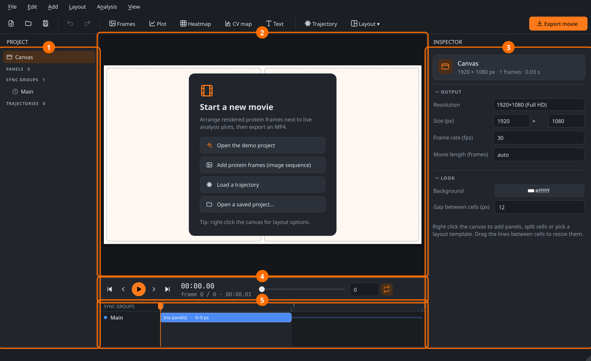

| # | Area | What it is for |
|---|---|---|
| **1** | **Project** | Everything in the project: panels, sync groups and trajectories. Click an item to edit it. Right-click for *add / delete*. |
| **2** | **Canvas** | A live preview of the movie frame, drawn by the same code that writes the video file. You also edit the layout here. |
| **3** | **Inspector** | Settings for whatever is selected. With nothing selected it shows the canvas settings: resolution, frame rate, background and the gap between cells. |
| **4** | **Transport** | Play/pause, frame steps and the scrub slider. Keys: <kbd>Space</kbd>, <kbd>←</kbd> <kbd>→</kbd>, <kbd>Home</kbd> <kbd>End</kbd>. |
| **5** | **Timeline** | One coloured bar per sync group, showing *when* in the movie each group plays (see step 8). Click to jump to a frame. |

**Set the output first.** Pick *1920×1080 (Full HD)* in the Inspector and choose a frame rate. The layout scales with the resolution, so you can change it later.

---

## 3. Choose a layout

Choose **Layout › Big left + 2 right**.

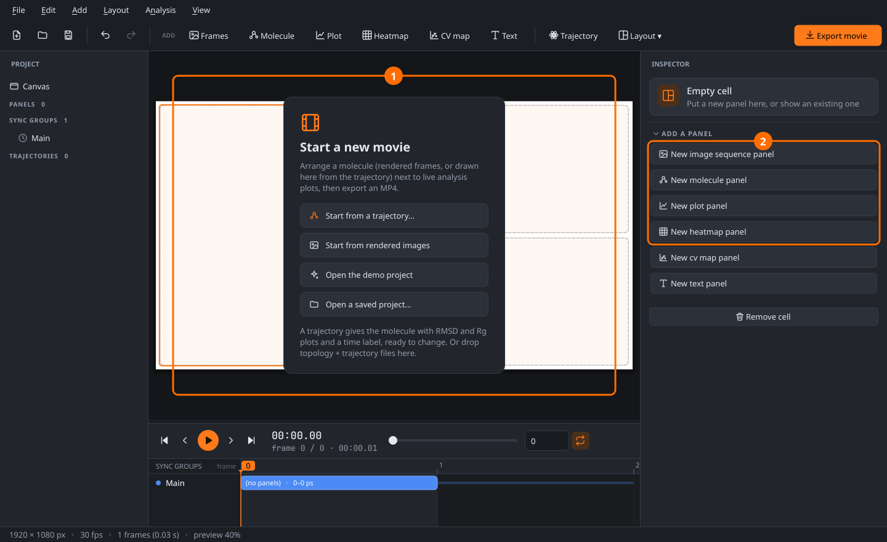

- **①** The canvas now has three empty cells, shown with dashed outlines. **Click** a cell to select it; it turns blue.
- **②** With an empty cell selected, the Inspector offers buttons to put a new panel in it.

You can reshape the layout at any time:

| To … | Do this |
|---|---|
| resize cells | drag the line between two cells |
| add a cell | right-click a cell › *Split cell* › *right / left / below / above* |
| remove a cell | right-click › *Remove cell* (the panel is kept, just not shown) |
| swap two panels | right-click › *Swap with* › … |
| start over | *Layout* menu › pick a template (your panels are kept, in order) |

Every change can be undone with <kbd>Ctrl+Z</kbd>.

---

## 4. Add the protein frames

Select the big left cell and click **New image sequence panel**. A folder dialog opens: choose the folder with your rendered frames. Next you're asked for the **File pattern**. It lists one pattern per image type found in the folder, with file counts (e.g. *2704 × .jpg*). Pick one or type your own. You get the same prompt when you change the folder later in the inspector.

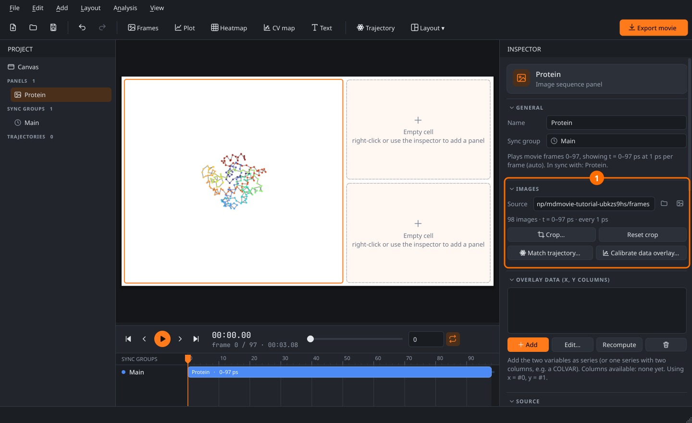

- **①** **Images** shows the folder and how many frames were found. Check the summary line: *98 images, t = 0–97 ps*. If it says *No images found*, fix the **File pattern** below it (e.g. `*.tga` or `frame.*.png`; comma-separated patterns are allowed).
- **②** **Timing** decides *which image is shown when*. Every image gets a simulation time:

  **t = t0 + k × dt**

  where **k** is either the image's position in the folder (*Frame index from: order*) or the number in its file name (*filename*).

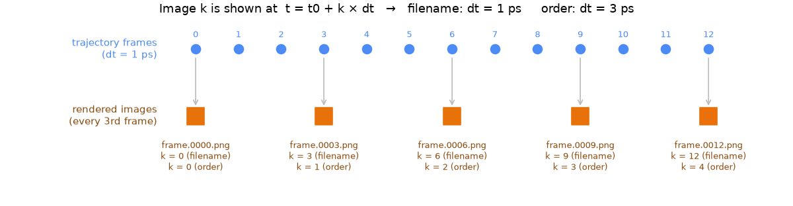

Use **filename** whenever your files carry the trajectory frame number. Then `dt` is simply the trajectory time step, and the app will warn you if frames are missing from the sequence. With **order**, `dt` must be the time *between two images*, i.e. the trajectory time step × stride.

Don't want to do the arithmetic? You can fill this in automatically in step 6.

---

## 5. Crop to a fixed aspect ratio

Rendered frames usually have wide empty margins. **Double-click** the protein panel (or press **Crop…** in the Inspector):

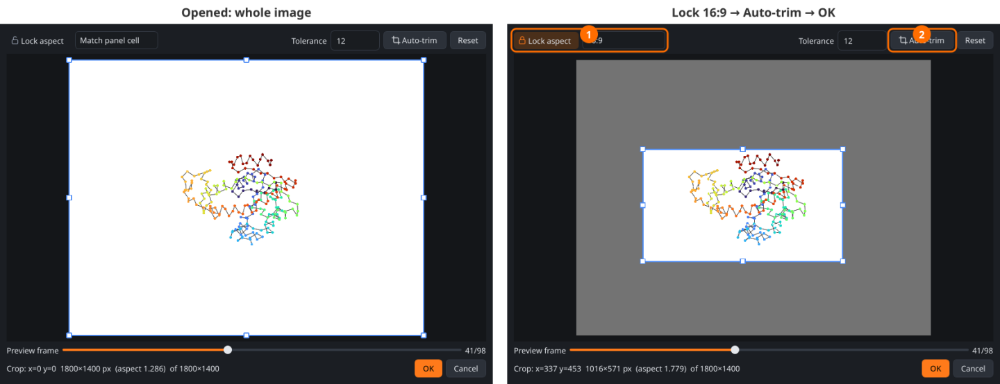

1. Switch on **Lock aspect** and pick a ratio. *16:9*, *4:3*, *1:1* and a custom *W : H* are available. **Match panel cell** uses the shape of the cell the panel sits in, so the protein fills it with no empty bars.
2. Press **Auto-trim**. It looks at ~20 frames across the whole sequence and fits the box around the molecule *in all of them*, so nothing moves out of view later in the movie. Raise **Tolerance** if a faint background gradient stops the trim.

You can also drag the box and its eight handles by hand; the ratio stays locked. Move the **Preview frame** slider to check the crop across the trajectory, then press **OK**. The same crop is applied to every frame.

---

## 6. Load the trajectory and line up the timing

Choose **Add › Load trajectory…** (<kbd>Ctrl+T</kbd>):

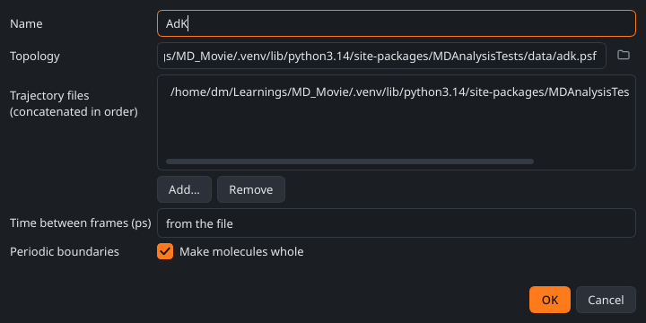

- **Topology**: PSF, PDB, GRO, PRMTOP, TPR, …
- **Trajectory files**: DCD, XTC, TRR, NC, …. Several files are joined in the listed order. Leave the list empty for a multi-model PDB.

The file is read with MDAnalysis when you press OK, so a wrong path shows up immediately.

Now go back to the protein panel and press **Match trajectory…**. It fills in `t0` and `dt` from the trajectory so the protein and the plots line up exactly. What you enter depends on how the images are indexed:

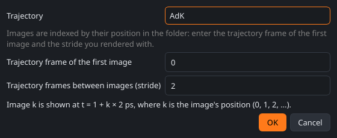

- **Frame index from: order**: enter the trajectory frame of the *first* image and the *stride* you rendered with. The dialog above shows stride 2, i.e. one image every second frame.
- **Frame index from: filename**, with files numbered by trajectory frame (`frame.00042.png` = frame 42): keep *0* and *1*.

The line at the bottom of the dialog spells out the resulting rule, e.g. *image k is shown at t = 1 + k × 2 ps*.

**Frame-wise instead:** if you rendered one image per trajectory frame (image k = frame k), you can skip the matching. Set each plot's **X axis (and sync clock)** to *frame* instead. The plot then runs on frame numbers, so it lines up with an image panel left at its default timing (`t0` = 0, `dt` = 1). For a stride, set the image panel's `dt` to the stride. Keep every panel in a sync group on the same clock: a plot in *frame* mode won't line up with an image panel that was matched in ps.

---

## 7. Add an RMSD plot

Select the top-right cell and click **New plot panel**. The series dialog opens:

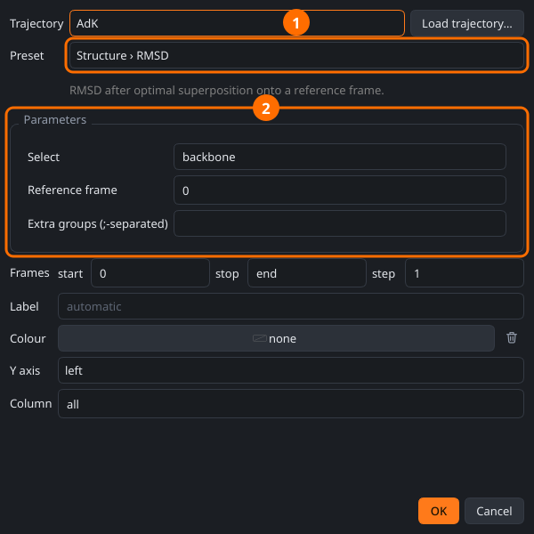

1. **Preset**: pick *Structure › RMSD*. The line underneath explains what it computes.
2. **Parameters**: every preset has its own parameters. For RMSD these are the atom selection (any [MDAnalysis selection](https://userguide.mdanalysis.org/stable/selections.html), e.g. `backbone` or `name CA and resid 1-120`) and the reference frame.

The lower half of the dialog lets you use every *n*-th frame, set a label and colour, put the line on the **right y-axis**, or keep only one column of a multi-column result.

Press **OK**. The analysis runs in the background; there is a progress bar in the status bar with a **Cancel** button. Results are cached, so the next time you open the project the plot appears instantly.

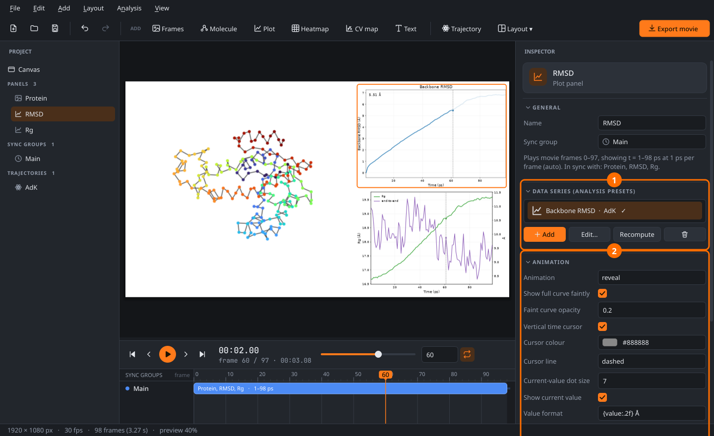

- **①** **Data series**: one plot can hold several series, from the same or from different trajectories (wild type vs mutant, replica 1 vs 2 …). ✓ means computed; ⚠ shows the error message if a preset failed, for example a selection that matched no atoms. Double-click a series to edit it.
- **②** **Animation**: how the plot moves with the movie.

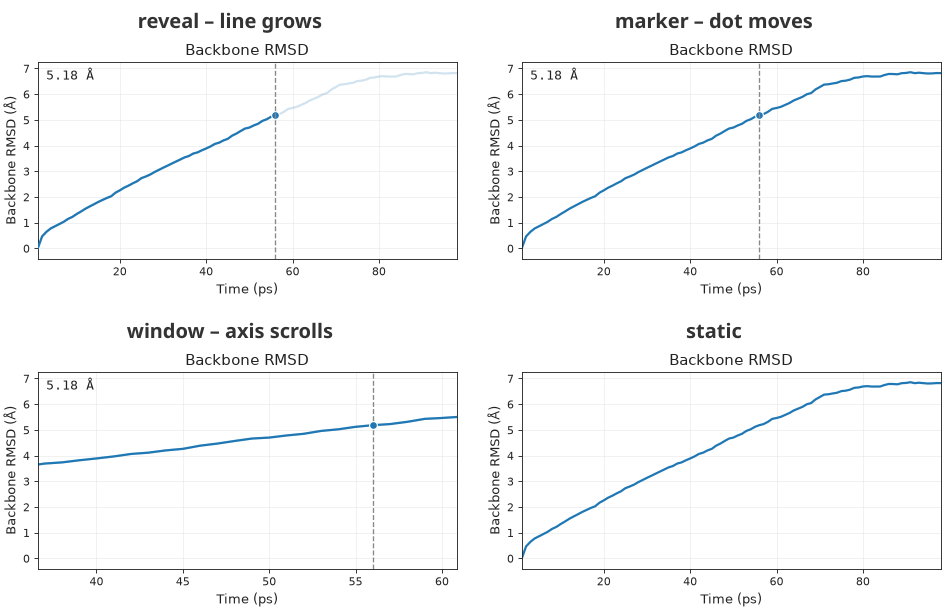

| Mode | Best for |
|---|---|
| **reveal** | "the property grows as the protein moves" — the classic choice. The faint grey curve shows what is coming; turn it off with *Show full curve faintly*. |
| **marker** | showing the whole curve from the start with a dot marking *now*. |
| **window** | long trajectories: the time axis scrolls. *Window width* 0 means a quarter of the data. |
| **static** | a plain figure with no time cursor. |

**Show current value** prints the value at the cursor, formatted with a Python format string, e.g. `{value:.2f} Å` or `{label}: {value:.1f}`.

The second plot in the example (bottom right) holds **two presets**: *Radius of gyration* on the left axis and *End-to-end distance* on the right axis (choose *Y axis: right* in the series dialog).

### Styles and fine-tuning

Every plot, heatmap and CV map has a **Plot style**. The *science*, *nature*, *ieee* and *notebook* styles come from the [SciencePlots](https://github.com/garrettj403/SciencePlots) package; *bmh*, *ggplot*, *seaborn* and others come with matplotlib. Combine a style with a **Colour palette** (*bright*, *vibrant*, *high-vis*, colourblind-safe sets, …). *clean* is the app's own look.

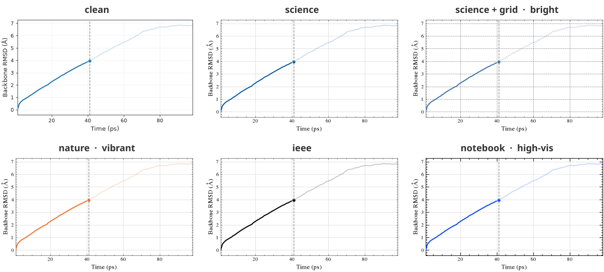

| Setting | Where | What it does |
|---|---|---|
| Plot style, colour palette, background (light/dark) | *Style* | the overall look |
| Font size, font family | *Style* | sizes are in points at the output resolution |
| LaTeX text | *Style* | real LaTeX typesetting of labels (needs LaTeX installed; the first draw takes a few seconds, later frames are as fast as usual) |
| Tick direction, minor ticks, frame (box / left + bottom / none), grid and its opacity | *Axes* | axis furniture |
| X/Y limits, right-axis limits, log or symlog y | *Axes* | blank limits mean automatic |
| Reference lines at y = …, marks at time = … | *Reference lines* | e.g. a threshold at `2.0`, or the moment a ligand leaves |
| Legend position (incl. outside the plot), frame, columns | *Legend* | |
| Cursor style, where the live value sits, faint-curve opacity | *Animation* | |

Each **series** also has its own look, set in the series dialog: **line style** (solid, dashed, dotted, dash-dot, none), **markers**, **line width**, **opacity**, and **shade the area under the curve**. In *reveal* mode the shaded area grows along with the line.

**Available presets:**
- **Structure**: RMSD, radius of gyration, RMSF per residue, end-to-end distance
- **Geometry**: distance between selections (centre of mass / centre of geometry / minimum), dihedral angles (φ ψ ω χ1), atoms within a cutoff
- **Interactions**: hydrogen bonds, native contacts (Q)
- **Secondary structure**: DSSP (use a **heatmap panel**), secondary-structure fractions
- **Data files**: *Data file (COLVAR / xvg / csv)* reads PLUMED COLVAR files, GROMACS `.xvg` files (energies, temperatures, …) or any CSV/whitespace table. It needs **no trajectory**: in the series dialog the trajectory is set to *(none)*. Column names come from the file's header (`#! FIELDS`, xvg legends or a CSV header row).
- **Custom**: *Custom expression*, any Python expression evaluated each frame. For example, `u.select_atoms('resid 50').center_of_mass()[2]` or `[ts.dimensions[0], ts.dimensions[2]]` for two columns.

---

## 8. Let one panel play on its own clock

So far everything is **synced**: at every movie frame, all panels show the same simulation time. That is what you want most of the time. But sometimes a panel should play on its own clock:

- the RMSD plot should start only after a title shot,
- two simulations of different length should both run from start to finish,
- a panel should loop.

This is what **sync groups** are for. Panels in the same group are always synced. A panel in its own group is independent.

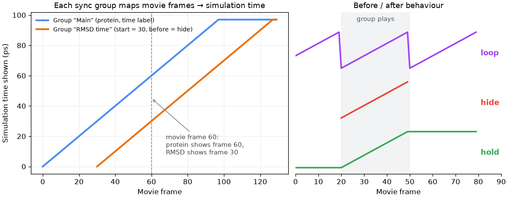

To make the RMSD plot independent, select it and choose **Sync group › New independent group…** in the Inspector. Then click the new group in the Project list or in the timeline:


- **①** **Timeline**: the RMSD now has its own orange bar. **Drag the bar** sideways to shift when it plays. The red line is the current frame.
- **②** **Sync group settings**:

| Setting | Meaning |
|---|---|
| **Starts at movie frame** | when the group begins playing |
| **Speed** | simulation ps per movie frame. *auto* shows one data frame per movie frame. Use 2× auto to play twice as fast, or ½ for slow motion. |
| **Play from / until time** | play only part of the trajectory, e.g. 50–80 ns. Leave blank for all. |
| **Before start / After end** | **hold** keeps showing the first/last frame, **hide** leaves the panel blank, **loop** repeats it (see the right half of the diagram above) |

With *Starts at movie frame = 30* and *Before start = hide*, the RMSD panel stays empty for one second and then draws its curve while the protein keeps playing. The movie automatically becomes long enough for the last group to finish. You can also fix the length under **Canvas › Movie length**.

---

## 9. Add a time label

Right-click on the canvas where the label should go and choose **Add overlay here › Text**. Overlays float on top of the layout; **drag** one to move it and drag its **blue corner** to resize it.

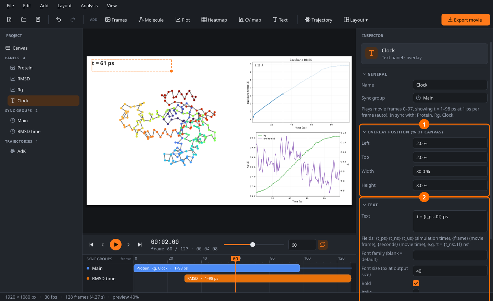

- **①** **Overlay position**: exact placement in % of the canvas, if you prefer numbers to dragging.
- **②** **Text**: a template that is filled in on every frame:

| Field | Shows | Example |
|---|---|---|
| `{t_ps}` `{t_ns}` `{t_us}` | simulation time of the panel's sync group | `t = {t_ns:.1f} ns` → *t = 12.5 ns* |
| `{frame}` | movie frame number | `frame {frame}` |
| `{seconds}` | movie time in seconds | `{seconds:.1f} s` |

Plain text works too, for titles, labels such as "WT" / "Mutant", or a reference. Any panel type can be an overlay, e.g. a small inset plot or a logo shown with an image panel.

---

## 10. Show a trajectory on a free-energy surface

Free-energy surfaces are usually made once from a long simulation or from enhanced sampling (metadynamics, umbrella sampling, …) and saved as a picture. The app can play a trajectory **on top of that picture**: a point marks the current CV values, with a fading trail behind it, synced to the rest of the movie.


*The example uses a toy two-basin COLVAR. `mdmovie.demo.write_toy_colvar("COLVAR")` writes one, so you can try this without your own data.*

### A. On your own pre-rendered FES picture

1. **Add an image panel** and point it at the FES picture: the second button next to *Source* picks a **single image file** instead of a folder. A single picture is treated as a static background, so the data sets the timing.
2. **Add the data.** In *Overlay data*, press **Add** and pick your CVs: *Data file (COLVAR / xvg / csv)* for a PLUMED COLVAR, or any trajectory preset (e.g. two *Dihedral angle* series for a Ramachandran-style map). The note below the list names the available columns; *X data* and *Y data: column #* choose which two are used.
3. **Calibrate** so the app knows where the plot axes sit inside the picture. Press **Calibrate data overlay…**:

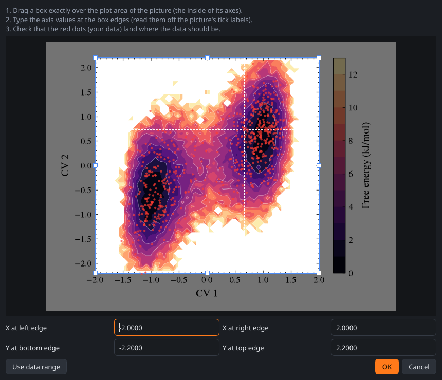

   Drag the box exactly over the **inside of the picture's axes**. Then type the axis values at the four edges, read off the picture's tick labels. Your data is drawn as red dots **while you calibrate**, so a correct calibration is obvious: the dots sit in the low-energy basins. If the picture was made from the same data, **Use data range** fills in the values.
4. Style the point and trail under **Data overlay**:

| Setting | Options |
|---|---|
| Current point | circle, square, diamond, triangle, star or cross; size, colour, outline |
| Trail | *fading line*, *line*, *fading dots* or *none*; length (in data points, 0 = everything so far), colour, width |
| Whole path | a faint line along the full trajectory, with its own colour and opacity |
| Clip to the plot area | keeps the trail from spilling over the picture's axes and colour bar |

Crop and fit keep working: the overlay follows the picture when you crop it.

### B. Computed from the data: the CV map panel

If you don't have a picture, **Add › CV map panel** (or *CV map* in the toolbar) computes the surface itself from the same x/y data:

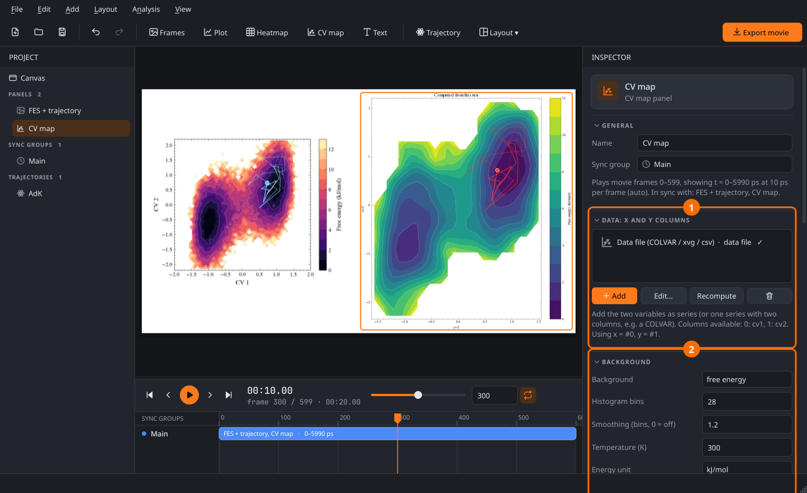

- **①** **Data**: two series, or one series with two columns. The note lists the columns and which ones are x and y.
- **②** **Background**:
  - *free energy*: F = −kT ln P(x, y), from a 2-D histogram. You set the bins, **smoothing** (Gaussian, in bins), temperature, unit (kJ/mol, kcal/mol, kT), an optional cap, colormap and contour lines.
  - *density*: the probability density itself.
  - *image file*: any picture stretched over given x/y limits.
  - *none*.

The point, trail and whole-path settings are the same as for the overlay, and every plot style from step 7 applies. Here both panels sit side by side and stay in sync:

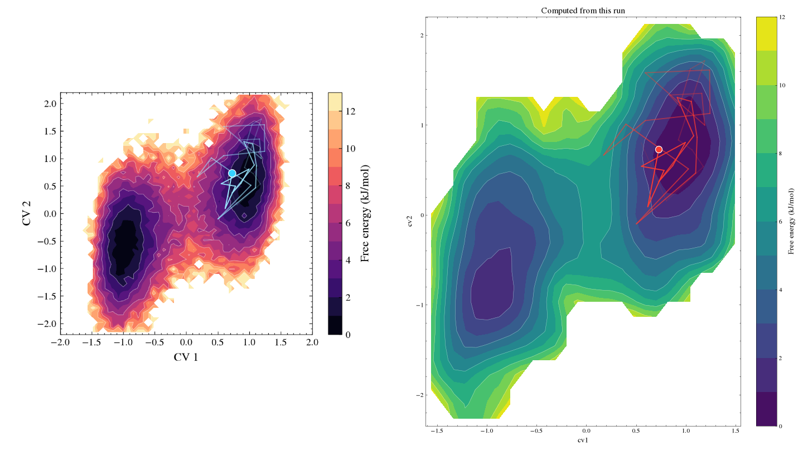

> A surface computed from a short run is noisy. Raise **Smoothing**, lower **Histogram bins**, or better, use the pre-rendered surface from your long or biased simulation (A) and animate the short run on top of it.

---

## 11. Export the movie

Press <kbd>Space</kbd> to play the preview, then **File › Export movie…** (<kbd>Ctrl+E</kbd>):

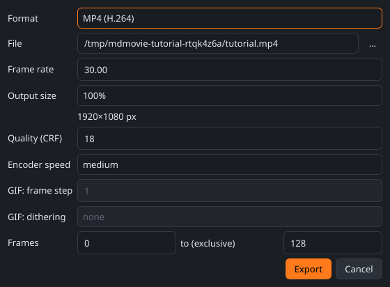

| Format | Notes |
|---|---|
| **MP4 (H.264)** | For talks and papers. Plays everywhere, including PowerPoint and Keynote. **Quality (CRF)**: 18 looks lossless, 23 gives smaller files, 0 is truly lossless. The ffmpeg encoder comes bundled; nothing to install. |
| **GIF** | For web pages and chat. All frames share one palette fitted to the movie, so colours stay put and only the parts that change are stored. *Dithering: none* (default) keeps flat colours and thin lines clean. *floyd-steinberg* smooths gradients but adds shimmer. Use 50 % size and *frame step* 2–3 for small files, or 100 % if small text must stay sharp. |
| **PNG sequence** | One image per frame, for editing in other software. |

*Output size* scales everything together (text, lines, images), so a 50 % export looks exactly like the full-size one, only smaller. *Frames* exports just a range.

Also useful: **File › Export current frame as PNG** (<kbd>Ctrl+Shift+E</kbd>) for a still figure, and **File › Save** for the project (a small `.mdmovie.json`; file paths are stored relative to it, so you can move the whole folder).

**Rendering without the GUI** (on a cluster, or in a script):

```bash
mdmovie render my.mdmovie.json movie.mp4 --crf 18
mdmovie render my.mdmovie.json movie.gif --scale 0.5 --gif-step 2
```

---

## 12. Write your own analysis preset

Any Python file you place in `~/.config/mdmovie/presets/` (for all projects) or `<project folder>/presets/` (for one project) is loaded at start-up. After editing a file, choose **Analysis › Reload preset files**. This is a complete preset:

```python
import numpy as np
from mdmovie.analysis.registry import Float, Sel, TimeSeries, iter_frames, preset

@preset("Salt bridge distance", category="Interactions", units="Å",
        params=[Sel("acidic", "resid 22 and name OE1 OE2", "Acidic oxygens"),
                Sel("basic", "resid 23 and name NZ", "Basic nitrogens"),
                Float("cutoff", 4.0, "Formed below (Å)")])
def salt_bridge(u, frames, progress, cancelled, acidic, basic, cutoff):
    from MDAnalysis.lib.distances import distance_array
    a, b = u.select_atoms(acidic), u.select_atoms(basic)
    t, d = [], []
    for ts in iter_frames(u, frames, progress, cancelled):   # handles progress bar + Cancel
        t.append(ts.time)
        d.append(distance_array(a.positions, b.positions, box=ts.dimensions).min())
    d = np.array(d)
    return TimeSeries(t, np.column_stack([d, d < cutoff]), ["distance", "formed"], "Å")
```

- The `params` list becomes the form in the series dialog. The parameter types are `Sel`, `Int`, `Float`, `Bool`, `Str` and `Choice`.
- Return one of three result types:
  - **`TimeSeries`** for plot panels (several columns become several lines)
  - **`Matrix`** for heatmap panels
  - **`Profile`** for static x–y data such as RMSF
- An exception is shown next to the series in the Inspector (⚠), so `raise ValueError("…")` makes a good error message.

This file is in [`examples/presets/salt_bridge.py`](../examples/presets/salt_bridge.py).

---

## 13. Troubleshooting

| Problem | Fix |
|---|---|
| *No images found* | Check the **File pattern** (`*.png` does not match `.tga`). Patterns match the file name only. |
| The protein and the plot are out of step | Use **Match trajectory…** (step 6), or set the plot's **X axis** to *frame* (image k = frame k). Otherwise check `dt`: with *order* indexing it must include the stride. The summary line under **Images** shows the time range the app assumes. |
| *⚠ missing frame numbers* | Some rendered frames are missing. The nearest existing frame is shown instead; re-render the gaps if that matters. |
| A plot says *Error: … matched no atoms* | Fix the selection in the series dialog (double-click the series). The analysis re-runs automatically. |
| A plot never finishes | Long trajectories take time; the status bar shows progress. Use the frame *step* in the series dialog to analyse every *n*-th frame. |
| The analysis result looks stale after changing the trajectory | Results are cached by file name *and* modification time, so a changed file is recomputed. To force it, select the series and press **Recompute**. |
| Overlay dots miss the basins | Re-open **Calibrate data overlay…**: the box must cover exactly the inside of the axes, and the edge values must match the tick labels. Check *X/Y data: column #* too. |
| CV map shows only a few blobs | Too few data points for the chosen bins: raise **Smoothing** or lower **Histogram bins**. |
| Preview stutters while playing | The export is unaffected (it renders every frame). Make the window smaller, or set the canvas to a lower resolution while editing. |
| Text looks tiny or huge | Font sizes are in pixels *at the output resolution*. Doubling the resolution doesn't shrink the text relative to the frame. |

### Keyboard shortcuts

| Key | Action |
|---|---|
| <kbd>Space</kbd> | play / pause |
| <kbd>←</kbd> <kbd>→</kbd> | previous / next frame |
| <kbd>Home</kbd> <kbd>End</kbd> | first / last frame |
| <kbd>Ctrl+Z</kbd> <kbd>Ctrl+Shift+Z</kbd> | undo / redo |
| <kbd>Delete</kbd> | delete the selected panel / overlay / cell |
| <kbd>Ctrl+T</kbd> | load a trajectory |
| <kbd>Ctrl+E</kbd> | export the movie |
| <kbd>Ctrl+S</kbd> | save the project |

---

<sub>All screenshots in this tutorial are generated from the real app by [`make_tutorial_images.py`](make_tutorial_images.py); re-run it after changing the UI.</sub>
